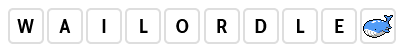

# 

Wailordle is a Pokémon guessing game, inspired by [Wordle](https://www.nytimes.com/games/wordle/index.html). It was originally created as a French-language, client-based alternative to Fireblend's [Squirdle](https://squirdle.fireblend.com/), although its inspiration has evolved since then.

## Instructions 🇫🇷

Vous devez retrouver un Pokémon d'une génération en particulier : 1 = Kanto, 2 = Johto, etc.

Le jeu vous précisera s'il s'agit d'une forme spéciale (méga-évolution, régionale) qui serait donc apparue plus tard.

Pour répondre, utilisez la barre de recherche 🔍 au bas de la page. Commencez à taper pour voir les noms des Pokémon de cette génération apparaître ; cliquez sur l'un d'eux pour faire une proposition.

Le jeu indique alors les types du Pokémon sélectionné accompagnés d'un symbole :
- ✅ si le type est celui du Pokémon à deviner,
- 🔃 si le type est à la mauvaise place,
- 🚫 si le Pokémon à deviner ne possède pas ce type.

Vous obtenez aussi un indice sur la taille du Pokémon à retrouver : 🔼 s'il faut viser plus grand, 🔽 pour l'inverse, ✅ si vous avez vu juste. Il en va de même pour le poids.

**Astuce** : survolez les différents indices avec la souris pour avoir des détails comme le poids et la taille exacts du Pokémon sélectionné.

## Credits

Created by **Kyrio** based on a concept by Fireblend.

The source code is available under the BSD 2-Clause License. The following resources are included in the repository but not part of the source code: 

- Pokemon species data adapted from [PokéAPI](https://github.com/PokeAPI/pokeapi) CSV files
  - Concerns: files in the `assets/json` directory
- Pokémon spritesheet provided by [PokéSprite](https://github.com/msikma/pokesprite)
  - Concerns: `pokesprite-` prefixed [CSS](assets/css/pokesprite-pokemon-gen8.css) and [PNG](assets/css/pokesprite-pokemon-gen8.png) files
  - Images © 2022 Pokémon. © 1995–2022 Nintendo/Creatures Inc./GAME FREAK inc.
- Emoji by [Fluent Emoji](https://github.com/microsoft/fluentui-emoji)
  - Concerns: files in the `assets/images/emoji` directory
- GitHub icon by [Octicons](https://github.com/primer/octicons)
  - Concerns: [mark-github.svg](assets/images/mark-github.svg)
- Fonts from the [Cabin](https://github.com/impallari/Cabin) family
  - Concerns: files in the `assets/fonts` directory
- Other images adapted from Pokémon games: © 2022 Pokémon. © 1995–2022 Nintendo/Creatures Inc./GAME FREAK inc.

All open source licenses are listed in [NOTICE](NOTICE).
